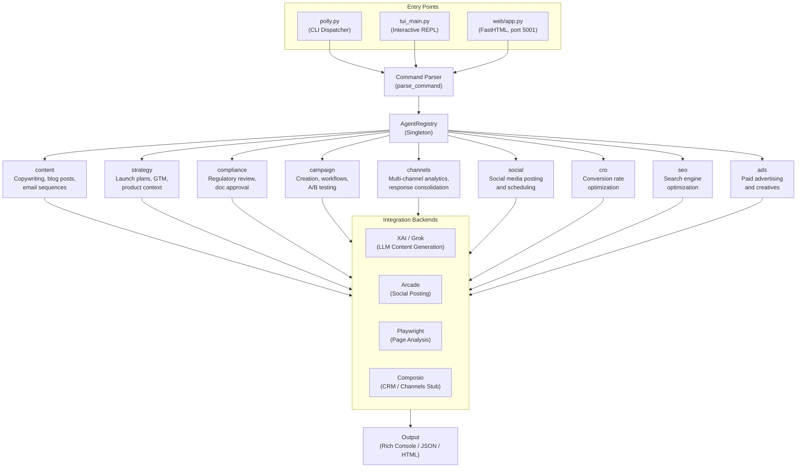
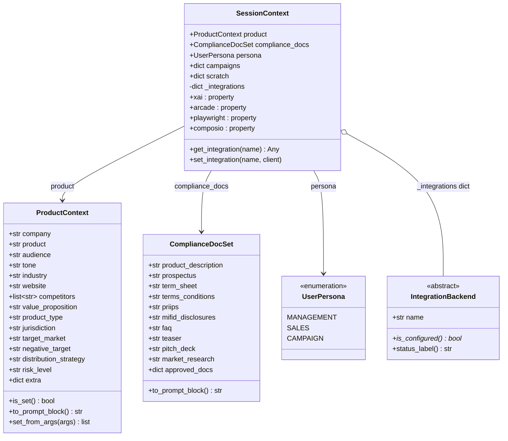
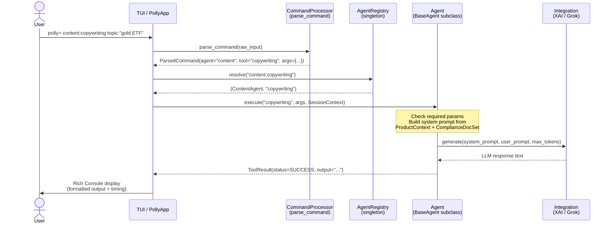
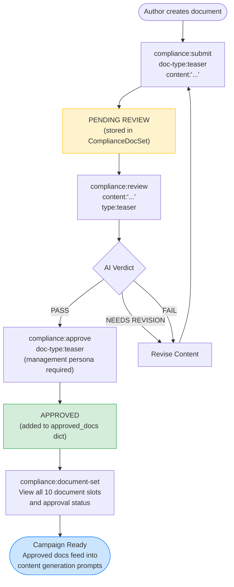
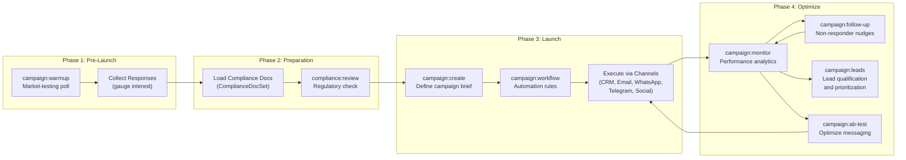
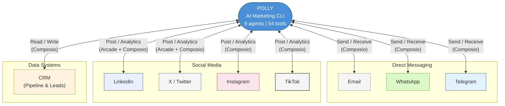

# POLLY Architecture

This document provides visual architecture diagrams for the POLLY AI Marketing CLI, rendered using Mermaid.js.

---

## 1. High-Level Architecture



---

## 2. Session Context Model



---

## 3. Agent Execution Flow



---

## 4. Compliance Document Workflow



---

## 5. Campaign Lifecycle



---

## 6. Multi-Channel Architecture



---

## Reference: Agent-Tool Map

| Agent | Tools | Integration |
|---|---|---|
| **content** | copywriting, blog posts, email sequences, ad copy | XAI |
| **strategy** | launch plans, GTM, product context, competitive analysis | XAI |
| **compliance** | review, submit, approve, document-set, target-market, risk-warnings | XAI |
| **campaign** | create, warmup, workflow, monitor, follow-up, ab-test, leads | XAI |
| **channels** | report, email, whatsapp, telegram, instagram, twitter, tiktok, crm, compare | XAI, Composio |
| **social** | social media posting, scheduling | XAI, Arcade |
| **cro** | conversion rate optimization | XAI, Playwright |
| **seo** | search engine optimization | XAI, Playwright |
| **ads** | paid ad creation, budget optimization | XAI |

## Reference: Command Syntax

```
agent:tool key:value key:"multi word value"
```

Examples:
```
content:copywriting topic:"structured product teaser" tone:professional
compliance:review content:"Capital at risk..." type:teaser jurisdiction:UK
campaign:warmup question:"Gold or equities in H2?"
channels:report period:7d format:summary
```

## Reference: Class Hierarchy

```
BaseAgent (ABC)
  +-- get_tools() -> list[ToolDefinition]
  +-- execute(tool_name, args, context) -> ToolResult
  +-- resolve_tool(tool_name) -> ToolDefinition | None
  +-- get_completions() -> list[str]

AgentRegistry (Singleton)
  +-- register(agent)
  +-- resolve("agent:tool") -> (agent, tool_name)
  +-- all_agents() -> list[BaseAgent]

IntegrationBackend (ABC)
  +-- XaiIntegration     (XAI_API_KEY)
  +-- ArcadeIntegration  (ARCADE_API_KEY)
  +-- PlaywrightIntegration (always available)
  +-- ComposioIntegration (COMPOSIO_API_KEY)
```
